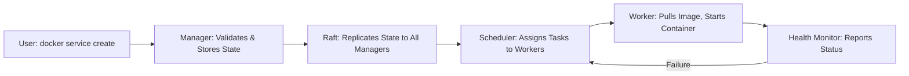
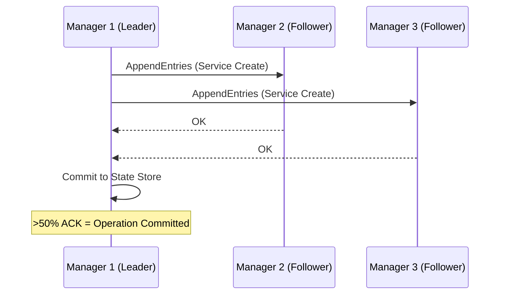
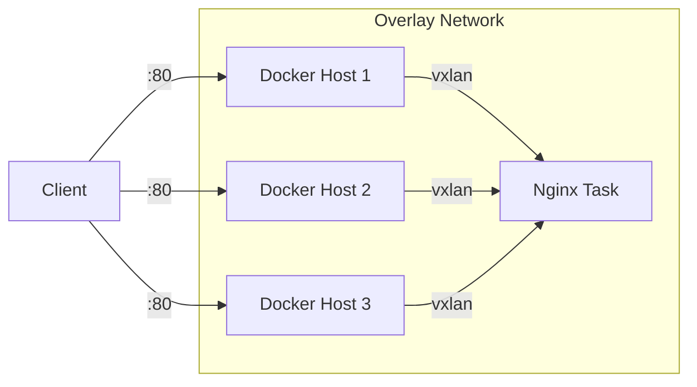

# 01. Docker Swarm Architecture: A Complete Guide

> **🎯 Learning Objectives**  
> By the end of this document, you will understand:
> - What Docker Swarm is and how it fits in the container orchestration landscape  
> - Core architectural components: Managers, Workers, Services, Tasks  
> - How consensus (Raft) ensures cluster reliability  
> - Network model: overlay, ingress, and service discovery  
> - When (and when *not*) to use Swarm in production  

---

## 🌐 1. What Is Docker Swarm?

Docker Swarm is **Docker’s native clustering and orchestration solution**, built directly into the Docker Engine (`dockerd`) since v1.12 (2016). It enables you to **group multiple Docker hosts** into a single logical unit — a *Swarm* — and deploy, scale, and manage containerized workloads declaratively.

Unlike external tools (e.g., Kubernetes), Swarm requires **no additional binaries**: just `docker swarm init` turns a host into a cluster.

### 🔍 Why Use Docker Swarm?

| Use Case | Why Swarm Fits |
|---------|----------------|
| **Simplicity-first teams** | No YAML sprawl; CLI-driven, minimal learning curve |
| **Lightweight workloads** | Low overhead vs. Kubernetes (no etcd, kubelet, etc.) |
| **CI/CD pipelines & cronjobs** | Easy service scheduling & lifecycle hooks (`--restart-delay`) |
| **Edge/IoT environments** | Small binary footprint, runs on Raspberry Pi |
| **Legacy monolith → microservices transition** | Incremental adoption without full infra rewrite |

> 💡 **Swarm ≠ Kubernetes**  
> Swarm is *not* a “lite Kubernetes”. It’s a different philosophy:  
> - **Swarm**: *Opinionated, integrated, imperative-leaning*  
> - **K8s**: *Extensible, modular, declarative*  
> - Choose based on team size, complexity, and operational appetite — not hype.

---

## 🧱 2. Core Architecture Components

A Swarm cluster is made of **Nodes**, organized into two roles:

### 🧠 Manager Nodes
The “brain” of the cluster.

| Responsibility | Details |
|----------------|---------|
| **Cluster State Management** | Maintains global view (services, networks, configs) via Raft consensus |
| **Orchestration & Scheduling** | Assigns tasks to workers based on constraints, resources, health |
| **API Endpoint** | Accepts `docker service create`, `docker stack deploy`, etc. |
| **TLS Mutual Auth** | Secures node-to-node & client-to-manager communication |

✅ **Best Practice**:  
Use **3 or 5 managers** for high availability.  
- 1 manager = no fault tolerance (single point of failure)  
- 3 managers = tolerate 1 failure  
- 5 managers = tolerate 2 failures  

> ⚠️ **Warning**: Never use **even-numbered** manager counts (e.g., 2 or 4). Raft requires majority (`⌊n/2⌋ + 1`) to elect a leader — even numbers risk split-brain.

### 💪 Worker Nodes
The “muscle” — execute containers.

| Responsibility | Details |
|----------------|---------|
| **Task Execution** | Runs containers (`tasks`) assigned by managers |
| **Health Reporting** | Sends heartbeat & task status every few seconds |
| **Minimal Overhead** | Only needs Docker Engine + joined token |

> 🔒 **Security Tip**:  
> Managers can *also* run tasks — but in production, set them to **Drain mode**:  
> ```bash
> docker node update --availability drain <manager-node-id>
> ```
> This dedicates them to control-plane duties only.

---

## 🧩 3. Workload Model: Services & Tasks

Swarm uses a **declarative service model** — you define *what* you want, not *how* to do it.

| Concept | Description | Analogy |
|--------|-------------|---------|
| **Service** | Desired state: e.g., *"Run 3 replicas of `nginx:alpine`, expose port 80"* | Blueprint |
| **Task** | Atomic unit of scheduling: **1 task = 1 container** | Brick in the wall |
| **Replica vs Global** | `replicas: N` → N instances total<br>`mode: global` → 1 instance per *eligible* node | Fixed count vs. “deploy everywhere” |

### 🔄 Service Lifecycle (Simplified)


> 💡 Tasks are **ephemeral and replaceable**. If a container crashes, Swarm replaces it *automatically* — no manual `docker restart`.

---

## 🗳️ 4. Consensus & High Availability: The Raft Protocol

Swarm uses **Raft**, a distributed consensus algorithm, to keep all managers in sync.

### How Raft Works in Swarm


- Only the **Leader** accepts writes (e.g., `docker service create`)  
- Followers replicate logs and vote in elections  
- If Leader fails, a new election occurs in seconds  

✅ **Guarantee**: As long as majority of managers are alive, the cluster remains writable.

---

## 🌐 5. Networking Model

Swarm provides **zero-config networking** across hosts.

### Key Networks
| Network | Purpose | Scope |
|--------|---------|-------|
| **Ingress** | Routes *external* traffic to services (L4 load balancing) | Cluster-wide |
| **Overlay (default)** | Connects containers across nodes (**encrypted by default**) | Per-stack/service |
| **Docker Host / Bridge** | Not used for Swarm services (only for standalone containers) | Host-local |

### ⚙️ How Ingress Works
1. User hits `http://<any-node-ip>:80`  
2. Swarm’s **routing mesh** (IPVS-based) directs request to *any* healthy task  
3. If service is on another node? Traffic is **transparently routed over overlay**



> 🔐 **Security Note**:  
> Overlay encryption is **enabled by default** in Swarm mode (AES in GCM mode). No extra setup needed.

---

## 📦 6. When to Use Docker Swarm (Real-World Fit)

| ✅ Ideal For | ❌ Avoid For |
|-------------|-------------|
| Small-to-mid teams (<10 engineers) | Large-scale microservices (>100 services) |
| Batch jobs, cronjobs, ETL pipelines | Complex stateful apps (e.g., Kafka, ZooKeeper) requiring operators |
| Edge/IoT deployments | Multi-cloud with strict vendor neutrality |
| Rapid prototyping / MVP | Need for advanced scheduling (affinity, taints, custom controllers) |

> 🌟 **Pro Insight**:  
> Many teams use **Swarm for batch workloads** (e.g., cronjobs, backups) and **Kubernetes for stateful apps** — a pragmatic hybrid approach.

---

## 🔧 7. Production Checklist

Before going live:
- ✅ Use **3+ managers** on separate failure domains (AZs, racks)
- ✅ Set managers to `drain` mode
- ✅ Enable auto-lock (`docker swarm init --autolock`) for manager re-joins
- ✅ Rotate swarm join tokens periodically:  
  ```bash
  docker swarm join-token --rotate worker
  ```
- ✅ Use **resource limits** (`--limit-memory`, `--limit-cpu`) to prevent noisy neighbors
- ✅ Store secrets with `docker secret create`, not env vars

---

## ➕ Further Reading
- [Docker Swarm Docs](https://docs.docker.com/engine/swarm/)
- [Raft Paper (Ongaro & Ousterhout)](https://raft.github.io/raft.pdf)
- [swarm-cronjob GitHub](https://github.com/crazy-max/swarm-cronjob) (for advanced cron scheduling)

> ✅ **Next**: [02. Cronjobs on Docker Swarm: Strategies & Trade-offs](./02_Cronjobs_on_Swarm.md)