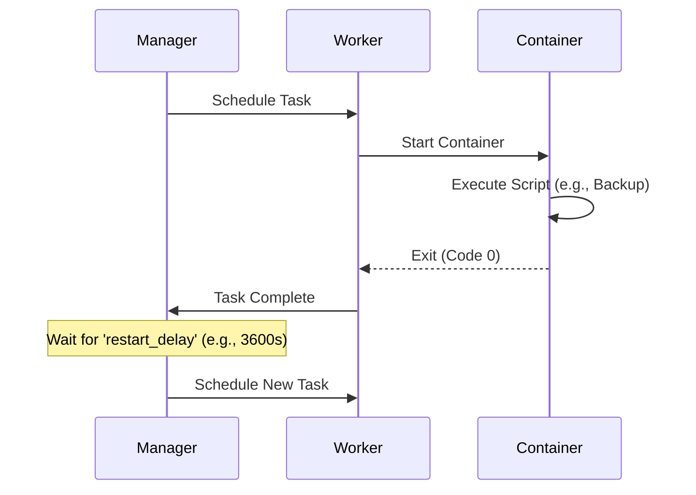
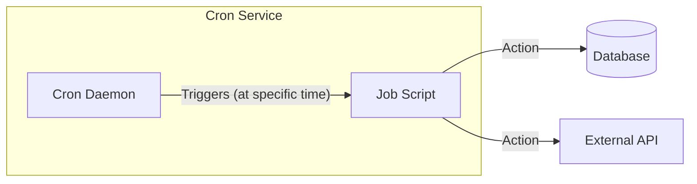

# 02. Cronjobs on Docker Swarm

## The Challenge
Docker Swarm **does not** have a built-in `CronJob` resource object like Kubernetes does.
Therefore, we must use specific strategies to achieve periodic task execution.

## Strategy 1: The "Restart Policy" Hack (Native)
You can run a service that executes a script and exits, relying on Swarm's restart policy to run it again.

### Concept
1. **Command**: Run script -> Exit.
2. **Restart Policy**: Wait `X` seconds -> Restart container.

### Visual Flow


### Pros & Cons
- ✅ **Pros**: Zero external dependencies.
- ❌ **Cons**: Not precise. Execution time "drifts" (Interval = Execution Time + Delay). Hard to schedule for specific times (e.g., "Every Monday at 3 AM").

---

## Strategy 2: Dedicated Cron Container (Sidecar/Standalone)
Run a container (like `alpine` or `ubuntu`) that has `crond` installed and running.

### Concept
A long-running service (`replicas: 1`) that acts as the scheduler. It executes commands inside itself or triggers other services via API.

### Visual Flow


### Pros & Cons
- ✅ **Pros**: Exact Cron syntax (`* * * * *`). Familiar.
- ❌ **Cons**: Single point of failure if that one node dies (though Swarm will respawn it).

---

## Strategy 3: Swarm-Cronjob (Recommended for Production)
Use a dedicated tool like [crazy-max/swarm-cronjob](https://github.com/crazy-max/swarm-cronjob).
This tool acts as a controller that listens for services with special labels and scales them up on schedule.

### Concept
1. **Controller**: A global service that monitors Docker events.
2. **Job Service**: A service scaled to `0` replicas initially.
3. **Labels**: You add labels like `swarm.cronjob.schedule` to the Job Service.
4. **Action**: When the schedule hits, the Controller scales the Job Service to `1`.

### Visual Flow
```mermaid
graph TD
    subgraph Swarm Managers
        Controller[swarm-cronjob Controller]
    end
    
    subgraph Services
        JobService[Target Service (Replica: 0)]
    end
    
    Controller -- Checks Time --> Controller
    Controller -- "Time Match!" --> API[Docker API]
    API -- "Scale Service to 1" --> JobService
    JobService -- "Task Complete" --> API
    API -- "Scale Service to 0" --> JobService
```

### Pros & Cons
- ✅ **Pros**: Native Swarm feel. Uses Docker labels. No "drift".
- ✅ **Pros**: Logs are separated by execution.
- ❌ **Cons**: Requires setting up an extra controller service.
