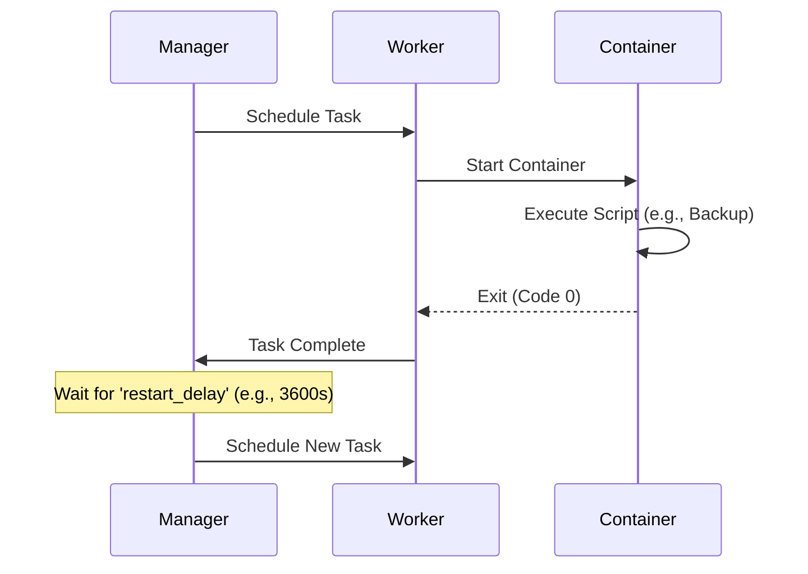
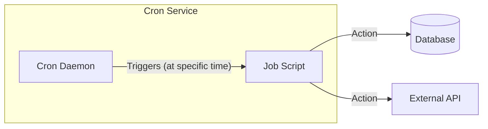
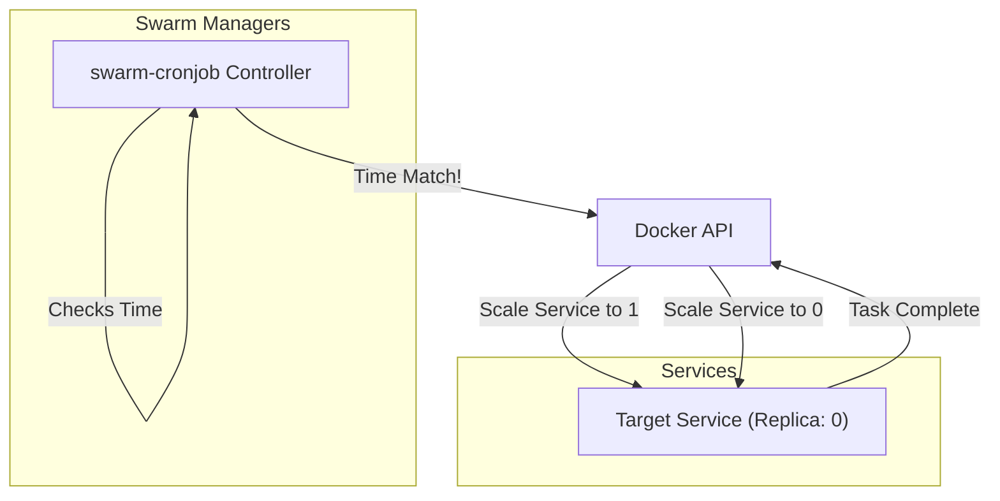

# 02. Cronjobs on Docker Swarm

## 1. Understanding Cron (The Basics)

### What is Cron?
**Cron** is a time-based job scheduler found in Unix-like operating systems. It enables users to schedule jobs (commands or shell scripts) to run periodically at fixed times, dates, or intervals.

### Why is it used?
In traditional server environments, Cron is the standard for automation. It is used for:
- **System Maintenance**: Rotating logs, checking disk space.
- **Backups**: Database dumps every night at 2 AM.
- **Data Sync**: Pulling data from an external API every 5 minutes.

### The Crontab Syntax
The schedule is defined in a "crontab" (Cron Table) file using a specific 5-field syntax:

```text
  ┌───────────── minute (0 - 59)
  │ ┌───────────── hour (0 - 23)
  │ │ ┌───────────── day of the month (1 - 31)
  │ │ │ ┌───────────── month (1 - 12)
  │ │ │ │ ┌───────────── day of the week (0 - 6) (Sunday to Saturday)
  │ │ │ │ │
  │ │ │ │ │
  * * * * * <command to execute>
```

**Common Examples:**
- `* * * * *`: Run every minute.
- `0 0 * * *`: Run every day at midnight.
- `0 9 * * 1`: Run at 9 AM every Monday.

---

## 2. The Challenge in Distributed Systems


Docker Swarm **does not** have a built-in `CronJob` resource object like Kubernetes does.
Therefore, we must use specific strategies to achieve periodic task execution.

## 3. Strategy 1: The "Restart Policy" Hack (Native)
You can run a service that executes a script and exits, relying on Swarm's restart policy to run it again.

### Concept
1. **Command**: Run script -> Exit.
2. **Restart Policy**: Wait `X` seconds -> Restart container.

### Visual Flow


### Pros & Cons
- ✅ **Pros**: Zero external dependencies.
- ❌ **Cons**: Not precise. Execution time "drifts" (Interval = Execution Time + Delay). Hard to schedule for specific times (e.g., "Every Monday at 3 AM").

---

## 4. Strategy 2: Dedicated Cron Container (Sidecar/Standalone)
Run a container (like `alpine` or `ubuntu`) that has `crond` installed and running.

### Concept
A long-running service (`replicas: 1`) that acts as the scheduler. It executes commands inside itself or triggers other services via API.

### Visual Flow


### Pros & Cons
- ✅ **Pros**: Exact Cron syntax (`* * * * *`). Familiar.
- ❌ **Cons**: Single point of failure if that one node dies (though Swarm will respawn it).

---

## 5. Strategy 3: Swarm-Cronjob (Recommended for Production)
Use a dedicated tool like [crazy-max/swarm-cronjob](https://github.com/crazy-max/swarm-cronjob).
This tool acts as a controller that listens for services with special labels and scales them up on schedule.

### Concept
1. **Controller**: A global service that monitors Docker events.
2. **Job Service**: A service scaled to `0` replicas initially.
3. **Labels**: You add labels like `swarm.cronjob.schedule` to the Job Service.
4. **Action**: When the schedule hits, the Controller scales the Job Service to `1`.

### Visual Flow


### Pros & Cons
- ✅ **Pros**: Native Swarm feel. Uses Docker labels. No "drift".
- ✅ **Pros**: Logs are separated by execution.
- ❌ **Cons**: Requires setting up an extra controller service.
