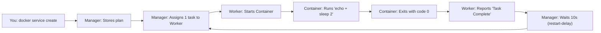

# 03. Hands-On Workflow: From Zero to Your First Cronjob on Docker Swarm  
*Designed for absolute beginners — no prior Swarm knowledge needed.*

> **🎯 What You’ll Build**  
> A scheduled job that runs every 10 seconds and prints:  
> `✅ Backup task ran at 2025-12-28 14:30:05 UTC`  
>   
> Along the way, you’ll learn:  
> - ✅ What a *Swarm* is (and why it’s useful)  
> - ✅ How to set one up on your laptop  
> - ✅ What a *service* and *task* mean  
> - ✅ How restart policies simulate cron  
> - ✅ How to watch logs and debug issues  

---

## 🧱 Part 0: What Is Docker Swarm? (1-Minute Primer)

Imagine you have **3 computers**, and you want them to work together like **one big computer** — where you say *“Run my backup script”*, and the system picks the best machine to run it.

That’s **Docker Swarm**:  
> 🐳 **Swarm = A group of Docker machines working as one cluster.**

- Each machine is called a **Node**  
- Some nodes are **Managers** (bosses — they decide what runs where)  
- Others are **Workers** (doers — they actually run containers)  
- You give orders to a Manager → it schedules work on Workers  

🟢 **For this tutorial**, we’ll use **just 1 machine** (your laptop), acting as both Manager *and* Worker.  
→ Perfect for learning!

---

## 🔧 Part 1: Setup — What You Need

| Requirement | How to Check | Install Link |
|-------------|--------------|--------------|
| **Docker Engine** (v20.10+) | `docker --version` → `Docker version 24.0.7, build ...` | [docs.docker.com/get-docker](https://docs.docker.com/get-docker/) |
| **Terminal** (bash/zsh) | Open `Terminal` (Mac/Linux) or **PowerShell** (Windows) | Built-in |
| **10 minutes of time** | ✅ You’ve got this! | — |

> 💡 **Tip for Windows Users**:  
> Use **Docker Desktop** (it includes Swarm support).  
> Enable Swarm mode in Settings → Docker Engine (add `"swarm-mode": true` if missing).

---

## 🚀 Part 2: Step-by-Step — Create Your First Swarm

Let’s turn your laptop into a **Swarm Manager**.

### 🔹 Step 1: Initialize the Swarm
Run this in your terminal:
```bash
docker swarm init
```

#### 📝 What This Does:
- Turns your machine into a **Swarm Manager**  
- Creates a secure cluster (with TLS encryption & Raft consensus)  
- Prints a command you’d use to add *other* machines (we’ll ignore that for now)

#### ✅ Expected Output:
```
Swarm initialized: current node (xyz123) is now a manager.

To add a worker to this swarm, run the following command:
    docker swarm join --token SWMTKN-1-abc...def 192.168.1.10:2377
```
> 📌 Save the node ID (`xyz123`) — it’s your machine’s unique name in the cluster.

#### 🔍 Verify It Worked:
```bash
docker info --format '{{.Swarm.LocalNodeState}}'
```
→ Should print: `active` ✅  
*(If it says `inactive`, run `docker swarm init` again.)*

---

## 📦 Part 3: Create a “Cron” Job (Using Restart Policy)

Since Swarm doesn’t have built-in cron, we’ll use a clever trick:  
> 🔄 **Let the container run → finish → wait → restart** → repeat!

Think of it like a **timer that resets after each run**.

### 🔹 Step 2: Create the Service

Run this command:
```bash
docker service create \
  --name daily-backup \
  --replicas 1 \
  --restart-condition any \
  --restart-delay 10s \
  alpine sh -c "echo '✅ Backup task ran at $(date -u)' && sleep 2"
```

Let’s break down **every part** so you *understand* what’s happening:

| Part | Meaning | Why It Matters |
|------|---------|----------------|
| `docker service create` | Create a *long-running workload* in Swarm | Services = the main unit of work in Swarm |
| `--name daily-backup` | Give it a human-friendly name | So you can find it later (`docker service ls`) |
| `--replicas 1` | “Keep exactly 1 copy running” | We only want *one* backup at a time |
| `--restart-condition any` | “Restart the container *no matter why* it exited” | Even if it succeeded (`exit 0`) or failed (`exit 1`) |
| `--restart-delay 10s` | “Wait 10 seconds *after* it exits, then restart” | 🕰️ This is our *cron interval*! |
| `alpine` | Use the tiny `alpine` Linux image (only 5 MB!) | Fast to download, minimal attack surface |
| `sh -c "..."` | Run this shell command inside the container | Our actual job: print time + wait 2s |

> 💡 **Inside the quotes**:  
> - `$(date -u)` → runs the `date` command *inside the container* and inserts the result  
> - `&& sleep 2` → waits 2 seconds so the container doesn’t exit *too* fast (helps with testing)

✅ **Result**:  
Every **~12 seconds** (10s delay + 2s sleep), a new container starts, prints the time, and exits.

---

## 🔍 Part 4: Watch It Run — Real-Time Monitoring

### 🔹 Step 3: See the Tasks Being Created
A *task* = one container running your command.

```bash
docker service ps daily-backup
```

#### ✅ Expected Output (after 30 seconds):
```
ID             NAME                IMAGE    NODE      DESIRED STATE  CURRENT STATE
abc123.1       daily-backup.1      alpine   xyz123    Running        Running 2 seconds ago
def456.2       daily-backup.2      alpine   xyz123    Shutdown       Complete 8 seconds ago
ghi789.3       daily-backup.3      alpine   xyz123    Shutdown       Complete 20 seconds ago
```

> 📌 Notice:  
> - New tasks get new IDs (`.1`, `.2`, `.3`)  
> - Old ones say `Shutdown` → `Complete`  
> - Only *one* task is `Running` at a time (thanks to `--replicas 1`)

### 🔹 Step 4: Watch the Logs Live
```bash
docker service logs -f daily-backup
```

Press `Ctrl+C` to stop.

#### ✅ You’ll See:
```
daily-backup.1.abc123 | ✅ Backup task ran at Mon Dec 28 14:30:05 UTC 2025
daily-backup.2.def456 | ✅ Backup task ran at Mon Dec 28 14:30:17 UTC 2025
daily-backup.3.ghi789 | ✅ Backup task ran at Mon Dec 28 14:30:29 UTC 2025
```

> 🕒 Timing:  
> `14:30:05` → `14:30:17` = **12 seconds**  
> Why? `10s` delay + `2s` sleep → perfect!

---

## 🧩 Part 5: Visual Workflow — How It Actually Works



🔁 This loop repeats forever — until you stop it.

---

## 🛠️ Part 6: Clean Up (Important!)

Don’t leave it running forever — clean up when done:

```bash
# Stop & remove the service
docker service rm daily-backup

# Leave the Swarm (optional — you can keep it for next time)
docker swarm leave --force
```

> ⚠️ `--force` is needed because you’re the only manager (no one else to hand off to).

---

## ❓ Part 7: Common Questions (Beginner-Friendly)

### Q: Why not just use real `cron` on my laptop?
A: You *could* — but:
- ❌ Cron runs on *one machine* → if it crashes, backup stops  
- ✅ Swarm runs on *a cluster* → if one node fails, another takes over  
- ✅ You get logs, metrics, scaling, secrets — all built-in  

### Q: What if my script fails (e.g., DB down)?
A: With `--restart-condition any`, it will retry after 10s — great for temporary failures!  
To *stop* on failure, use `--restart-condition on-failure` instead.

### Q: Can I run it at *exactly* 2 AM daily?
A: ❌ Not with this method — drift will happen.  
✅ Use [`swarm-cronjob`](https://github.com/crazy-max/swarm-cronjob) for precise timing (covered in advanced guides).

---

## 🎁 Bonus: Try It Yourself!

Change the interval to **every 30 seconds**:
```bash
docker service create \
  --name test-job \
  --restart-condition any \
  --restart-delay 30s \
  alpine sh -c 'echo "⏰ Tick at $(date -u)"'
```
Then watch:
```bash
docker service logs -f test-job
```

When done:
```bash
docker service rm test-job
```

---

## ➕ Next Steps
- ✅ You now know how Swarm services + restart policies work!  
- ➡️ [04. Command Reference: Cheat Sheet for Beginners](./04_Command_Reference.md)  
- 🔜 Later: Learn `swarm-cronjob` for *real* cron (`0 2 * * *` syntax).