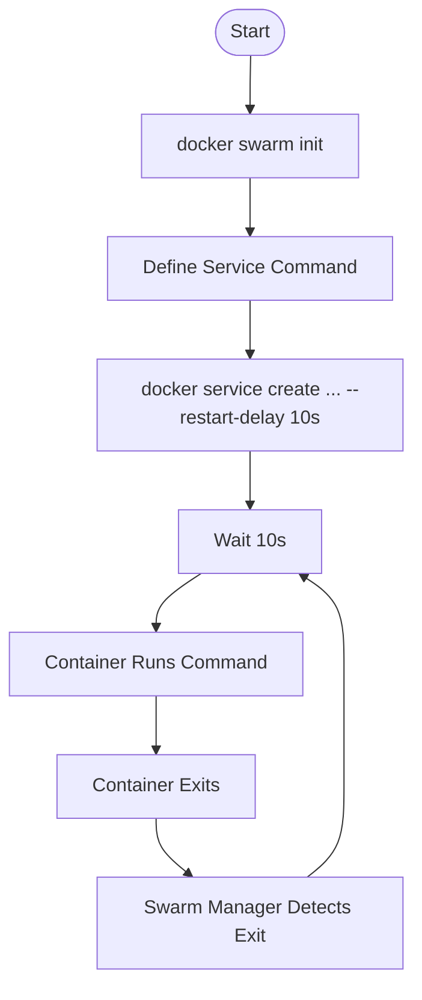

# 03. Workflow Guide: Implementing Swarm Cronjobs

This guide provides a step-by-step workflow to implement a cronjob using the **Service Restart Policy** method.

## Prerequisites
- Docker installed (v1.13+).
- A machine initialized as a Swarm Node.

## Step-by-Step Implementation

### Phase 1: Initialize Swarm
If your Docker host is not yet a swarm, initialize it.
```bash
docker swarm init
```
*Output Check*:
> Swarm initialized: current node (xyz...) is now a manager.

### Phase 2: Create the Service
We will create a service named `daily-backup` that runs a command `echo "Backup started..."`.
We want this to run **every 10 seconds** (for testing purposes).

**Command Breakdown:**
- `--name daily-backup`: Names the service.
- `--replicas 1`: Runs one instance.
- `--restart-condition any`: Restarts the container when it exits.
- `--restart-delay 10s`: Waits 10s before the restart (The "Cron" interval).
- `alpine`: The image to use.
- `sh -c "..."`: The actual command.

**Execute:**
```bash
docker service create \
  --name daily-backup \
  --replicas 1 \
  --restart-condition any \
  --restart-delay 10s \
  alpine sh -c "echo 'Performing Backup Task at $(date)' && sleep 2"
```

### Phase 3: Monitor the Execution
Verify the service is running and the tasks are being created.
```bash
docker service ps daily-backup
```
*You should see a list of tasks, with new ones appearing every ~12 seconds (10s delay + 2s execution)*.

### Phase 4: Verify Logs
Check the logs to see the output of your script.
```bash
docker service logs -f daily-backup
```

**Expected Output:**
```text
daily-backup.1.abc... | Performing Backup Task at Fri Dec 27 10:00:00 UTC 2025
daily-backup.1.def... | Performing Backup Task at Fri Dec 27 10:00:12 UTC 2025
```

## Workflow Diagram (Visual Summary)



## Troubleshooting
| Issue | Potential Cause | Fix |
| :--- | :--- | :--- |
| **Service stuck in 'Pending'** | No suitable node found (Architecture/Resources). | Check `docker node ls` and `docker service ps <name> --no-trunc`. |
| **Logs are empty** | Command failed immediately or no stdout. | Run the image locally with `docker run` to debug the script. |
| **Error during connect** | Docker Daemon down. | Start Docker Desktop. |
